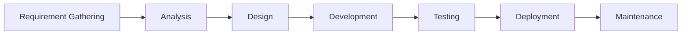
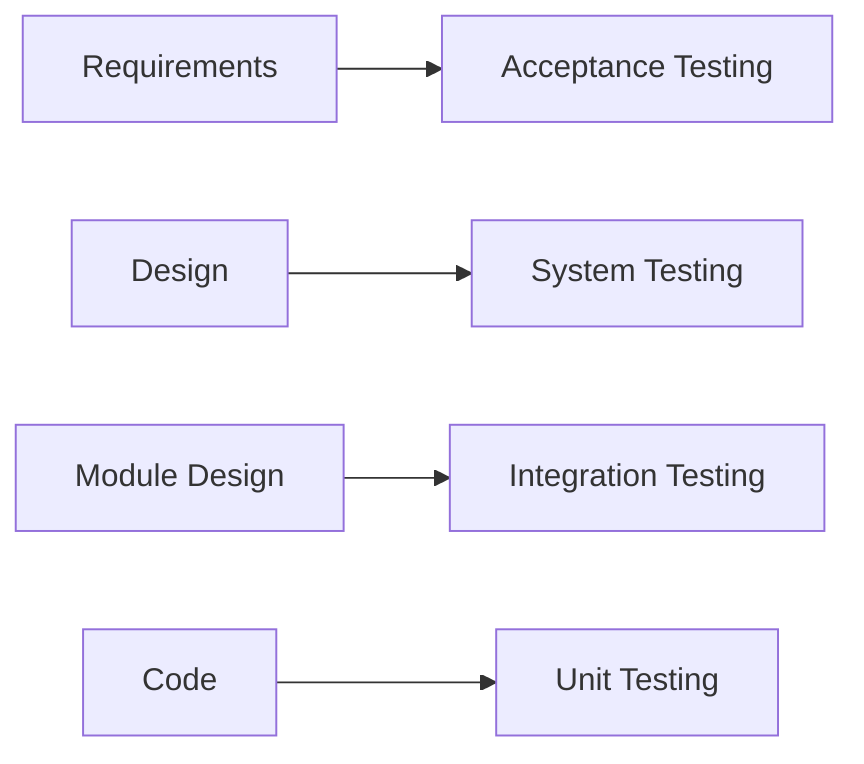
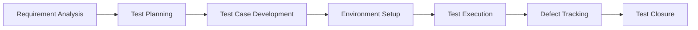

# 02. SDLC and STLC

## 1. What is SDLC?

SDLC stands for Software Development Life Cycle. It is the step-by-step process used to develop software from requirement gathering to maintenance.

### SDLC Phases

1. Requirement Gathering
2. Analysis
3. Design
4. Development
5. Testing
6. Deployment
7. Maintenance

### Diagram

---

## 2. Waterfall Model

Waterfall is a traditional and sequential model. Each phase is completed before the next begins.

### Characteristics

- linear flow
- requirements must be clear upfront
- less flexible for change
- suitable for small fixed projects

### Pros

- easy to manage
- clear milestones
- good for stable requirements

### Cons

- difficult to handle changing requirements
- late feedback from users

> In interviews, a common answer is that Waterfall is rigid and sequential, while Agile is iterative and flexible.

---

## 3. Spiral Model

Spiral model is risk-driven and repeated in cycles. Each iteration adds more features and reduces risk gradually.

### Characteristics

- repeated development cycles
- risk analysis in each phase
- good for large and complex projects
- encourages early identification of risks

### Best for

- large applications
- projects with high uncertainty
- systems where risk is significant

---

## 4. V-Model (Verification and Validation)

In V-Model, each development phase is paired with a testing phase.

### Example mapping

- Requirements → Acceptance Testing
- Design → System Testing
- Module Design → Integration Testing
- Coding → Unit Testing

### Diagram

### Key point

V-model emphasizes testing at each stage, so defects are detected earlier.

---

## 5. Agile Model

Agile is a flexible methodology that focuses on iterative delivery and continuous customer feedback.

### Key features

- shorter development cycles
- working software delivered in increments
- requirement changes are acceptable
- close collaboration between teams

### Agile concepts

- Scrum
- Kanban
- Sprint
- Daily standup
- Retrospective

> Agile is widely used in real-world projects because it supports rapid changes and faster delivery.

---

## 6. What is STLC?

STLC stands for Software Testing Life Cycle. It is a sequence of testing activities carried out to ensure software quality.

### STLC phases

1. Requirement Analysis
2. Test Planning
3. Test Case Development
4. Environment Setup
5. Test Execution
6. Defect Tracking
7. Test Closure

### Diagram

---

## 7. Requirement Analysis

In this phase, the tester studies requirements and identifies:

- functional requirements
- non-functional requirements
- testable items
- risks and ambiguities

### Output

Test basis and testable conditions.

---

## 8. Test Planning

Test planning defines:

- test objective
- scope
- resources
- test strategy
- risks
- schedule

### Important test plan items

- test approach
- entry/exit criteria
- assumptions
- dependencies

---

## 9. Test Case Development

This phase includes designing:

- test scenarios
- test cases
- test data
- traceability matrix

### Key goal

Ensure the test coverage matches the business and technical requirements.

---

## 10. Environment Setup

The testing environment should be prepared with:

- required software
- browser versions
- database/data set
- supported OS
- dependencies and tools

---

## 11. Test Execution

This is where testers execute the planned test cases and record:

- actual result
- expected result
- pass/fail status
- defects found

### Important note

If actual result is different from expected result, record a defect.

---

## 12. Defect Tracking and Reporting

Any mismatch between expected and actual behavior becomes a defect. The defect must be logged, assigned, and tracked till closure.

---

## 13. Test Closure

At the end, testers prepare:

- test summary report
- defect summary
- coverage report
- lessons learned

---

## 14. Difference Between SDLC and STLC

| SDLC | STLC |
| -- | -- |
| Covers full software development lifecycle | Covers testing activities only |
| Starts with requirement gathering | Starts after requirements are understood |
| Includes development and deployment | Includes planning, execution, defect tracking |

> SDLC is about building the product; STLC is about validating the product.

---

## 15. Interview Questions and Answers

### Q1. What is SDLC?

Answer:

> SDLC is the sequence of phases followed to develop software, starting from requirement gathering to maintenance.

### Q2. What is STLC?

Answer:

> STLC is the process of testing activities performed to validate whether the software meets requirements and is free from defects.

### Q3. Difference between Waterfall and Agile?

Answer:

> Waterfall is sequential and rigid, while Agile is iterative and adaptive to frequent changes.

### Q4. What is V-Model?

Answer:

> V-Model pairs each development phase with a testing phase, making testing a built-in part of the lifecycle.

---

## 16. Quick Revision Summary

- SDLC is the full product development life cycle.
- STLC is the testing-specific lifecycle.
- Waterfall is linear, rigid, and traditional.
- Spiral is risk-driven and iterative.
- V-model emphasizes early validation.
- Agile supports frequent updates and quick delivery.

---

## Final Interview-Ready Short Answer

> SDLC is the complete process of creating software, while STLC is the testing-focused process that ensures quality at every step. Waterfall is a strict sequential model, Agile is iterative and flexible, and V-model connects each development stage with a corresponding testing stage. These models help teams manage risk, quality, and delivery efficiently.
