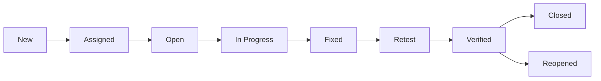

# 05. Defect Management and Bug Reporting

## 1. What is a Defect?

A defect, also called a bug, is a condition where the actual result differs from the expected result.

### Example

- Expected: Save button stores user details
- Actual: button does nothing

This is a defect.

---

## 2. Defect Life Cycle

A defect goes through several stages:

1. New
2. Assigned
3. Open
4. In Progress
5. Fixed
6. Retest
7. Verified
8. Closed
9. Reopened (if required)

### Diagram

---

## 3. Severity vs Priority

### Severity

Severity describes the impact of the defect on the system.

Examples:

- Critical: application crashes, data loss, security issue
- Major: important feature is broken
- Moderate: feature works but in a limited way
- Minor: cosmetic or minor usability issue

### Priority

Priority defines how quickly the defect needs to be fixed.

Examples:

- P1: fix immediately
- P2: fix in next release
- P3: fix when time allows

> Severity is about business/system impact; priority is about urgency.

---

## 4. Bug Report Template

A proper defect report usually includes:

- Defect ID
- Title
- Severity
- Priority
- Module/Feature
- Environment
- Steps to reproduce
- Expected result
- Actual result
- Screenshots/video
- Assignee
- Status

### Example defect report

**Title:** Login button does not work for valid credentials

- Severity: Major
- Priority: P1
- Steps: 1. Open login page 2. Enter valid username and password 3. Click Login
- Expected: User should be redirected to dashboard
- Actual: Error message displayed and page remains on login screen

---

## 5. Good Bug Reporting Practices

- Clear and specific title
- Mention exact steps
- State expected vs actual result
- Include environment details
- Add screenshot/video if possible
- Avoid emotional or blame language
- Keep it reproducible

---

## 6. Duplicate Defects

When the same defect is reported multiple times, it is considered a duplicate. The tester should avoid duplicate entries and use the existing defect ID.

---

## 7. Defect Rejection

A defect can be rejected if it is not reproducible, not valid, or outside the product requirements.

### Common rejection reasons

- not reproducible
- duplicate
- not a valid defect
- requirement mismatch due to misunderstanding

---

## 8. Defect Closure

A defect is closed when:

- fix is implemented
- retest is passed
- the developer and tester agree the issue is resolved

---

## 9. Bug Reporting Interview Questions

### Q1. What is severity?

Answer:

> Severity indicates the impact of a defect on the software functionality or business process.

### Q2. What is priority?

Answer:

> Priority indicates how quickly the defect must be fixed.

### Q3. Difference between severity and priority?

Answer:

> Severity is about impact; priority is about urgency.

### Q4. What is a defect life cycle?

Answer:

> It is the status flow of a defect from discovery to closure, including new, assigned, fixed, retest, and closed.

---

## 10. Quick Revision Summary

- Defect = mismatch between expected and actual result
- Severity = impact level
- Priority = urgency to fix
- Bug report must be clear, reproducible, and evidence-based
- Defects follow a lifecycle from creation to closure

---

## Final Interview-Ready Answer

> A defect is any deviation between expected and actual behavior. It should be reported with clear reproduction steps, expected result, actual result, and supporting evidence like screenshots. Severity indicates the level of impact on the system, while priority tells how quickly it should be resolved. Proper bug reporting and triage help teams fix the right issues efficiently and reduce release risk.
