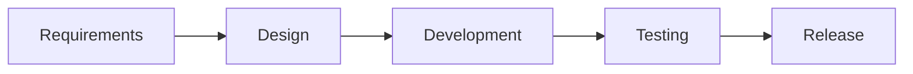

# 07. Manual Testing Quick Revision Sheet

## 1. Core Definitions

### Manual Testing
Manual testing is the process of checking software manually to compare actual results with expected results and detect defects.

### QA
QA is a process-oriented activity that focuses on preventing defects by improving processes and standards.

### QC
QC is a product-oriented activity that checks whether the product meets requirements.

### Verification
Verification checks whether we are building the product correctly.

### Validation
Validation checks whether we are building the right product.

---

## 2. SDLC vs STLC

### SDLC
Software Development Life Cycle

Phases:
- Requirement gathering
- Analysis
- Design
- Development
- Testing
- Deployment
- Maintenance

### STLC
Software Testing Life Cycle

Phases:
- Requirement analysis
- Test planning
- Test case development
- Environment setup
- Test execution
- Defect tracking
- Test closure

---

## 3. Models

### Waterfall
- Sequential
- Rigid
- Requirements fixed early
- Good for simple and stable projects

### V-Model
- Development and testing happen in parallel stages
- Strong verification at each level

### Spiral
- Risk-driven
- Repeated cycles
- Good for complex and high-risk projects

### Agile
- Iterative and incremental
- Flexible to changing requirements
- Frequent deliverables

---

## 4. Test Scenario vs Test Case

### Test Scenario
High-level business flow or user journey.

Example:
- User logs in and places an order

### Test Case
Detailed, step-by-step validation with inputs and expected results.

Example:
- Enter valid username
- Enter valid password
- Click Login
- Expected: dashboard opens

---

## 5. Positive vs Negative Testing

### Positive Testing
Valid input produces expected result.

Example:
- valid username + valid password → login success

### Negative Testing
Invalid input should be caught properly.

Example:
- wrong password → error message displayed

---

## 6. Important Test Design Methods

### Boundary Value Analysis
Check values at edges of ranges.

Example:
- if age range is 18 to 60, test 17, 18, 60, 61

### Equivalence Partitioning
Divide inputs into classes that behave similarly.

### Decision Table Testing
Used for multi-condition rules.

### State Transition Testing
Check flows between states.

### Error Guessing
Use experience and intuition to anticipate likely failures.

---

## 7. Types of Testing

### Functional Testing
Validates business functionality.

### Non-Functional Testing
Includes performance, security, usability, compatibility.

### Smoke Testing
Very quick check of critical functions.

### Sanity Testing
Focused validation after a small change.

### Regression Testing
Ensures old functionality is not broken by changes.

### Retest
Checks if a fixed bug is resolved.

### Exploratory Testing
Testing while learning and discovering issues simultaneously.

### UAT
User acceptance testing before release.

---

## 8. Defect Basics

### Defect
Mismatch between expected and actual result.

### Severity
Impact of defect on system/business.

### Priority
Urgency with which defect should be fixed.

### Defect Life Cycle
New → Assigned → Open → In Progress → Fixed → Retest → Verified → Closed

---

## 9. Best Practices for Bug Reporting

- Clear title
- Steps to reproduce
- Expected result
- Actual result
- Environment details
- Screenshot/video
- Severity and priority

---

## 10. Fast Interview Memory Line

> Testing is the process of validating whether software works correctly, meets requirements, and is ready for real users without critical defects.

---

## 11. Final Revision Summary

- Manual testing is human-based validation.
- SDLC builds the product; STLC validates it.
- Agile is iterative; Waterfall is sequential.
- Good testing covers both valid and invalid conditions.
- Regression and retest are critical after changes.
- Defect reporting must be clear and evidence-based.
- Real success means user satisfaction and release confidence.
