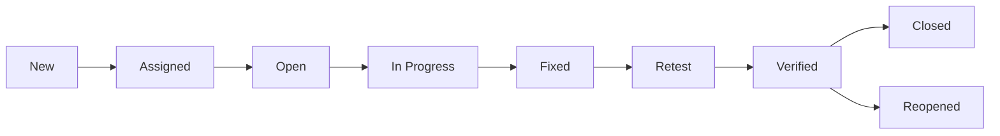

## 1. What is Manual Testing?
> Testing the software or application repetatly  or again and again manually in order to find the defect in to software according to the customer requirement is called as manual testing. 

# Content of Manual testing

1. SDLC (software development life cycle)
2. Software Testing
3. Test cases
4. STLC (software testing life cycle)
5. Test Plan
6. Defect life cycle
7. ISTQB Question

---
## 1. SDLC (software development life cycle)
Defination : SDLC is a step by step procedure or standard procedure to develop a new software. 

## Types of SDLC Model
1. Waterfall model
2. Spiral Model
3. V & V Model
4. Prototype Model
5. Dirived Model
6. Hybride Model
7. Agile Model

### Waterfall model
Waterfall model is a step by step procedure or standard procedure to develop a new software.

#### Stage
- Requirement Collection
    - feasibilty Study
        - Design
            - Coading
                - Testing
                    - Installation
                        - Mainataince

#### Spiral model

Note: Add stage or diagram

#### V and V Mdodel

Note: Add stage or diagram

#### Agile Model
- Agile is an itaration and incrimental approch where customer keeps on chnaging the requirement as company we will flexible enough to take up all the requiremnt chnages. develop the chnages, test the chnages and give quality software to customer within short span of time "This is called as Agile"

#### Principles of Agile / Advantages
- Customer can chnage the requiremnet at any stage of development
- There will good communication between customer, BA, Developer and test engineer.
- Release should be very short
- Our highest prioroty is customer satisfication by quick delivery.
- Software is very simple model to follow
- Teams will be self organized
- Dev's, TE's , and BA will be having meeting very regulary, It will be helpfull to imporve the preocss. 

#### Scrum model
- Scrum model is standard procedure which helps team to work together and develop a new software. 

#### Agile terminologies
1. **Release** : Combination of sprints is called as Release.
2. **Epic** : complite set of requiremnt is called as Epic.
3. **User Story** : Stories are nothing but feature or functionality or module.
4. **Story point** : Story point is a rough estimation given by developers and test engineers to develop & test every indivisual stories.
5. **Swag** : Swag is rough estimation given by decelopers and test engineer to develop and test every individual stories in the from of hours.
6. **Sprint** : It is the actual time spen by the developer and test engineers to develop and test one or more stories.

#### Scrum meetings / scrum ceremonies
1. **print Planning**: Sprint Planning is a Scrum event where the Scrum Team collaboratively decides what work will be completed during the upcoming Sprint and creates a plan for delivering it.

    - Reviews and discusses Product Backlog Items/User Stories.
    - Clarifies requirements and acceptance criteria.
    - Selects the work that can realistically be completed in the Sprint.
    - Breaks stories into tasks where appropriate.
    - Estimates the work and identifies dependencies or risks.
    - Defines the Sprint Goal.

2. **Scrum Meeting / Daily Scrum / DSM** : Daily Scrum is a short, daily Scrum event where Developers inspect progress toward the Sprint Goal and identify any impediments or adjustments needed to achieve the Sprint Goal.  Typical discussion:
    - What did I complete yesterday?
    - What am I planning to work on today?
    - Do I have any blockers or impediments?

3. **Sprint Retrospective Meeting** : Sprint Retrospective is a Scrum event held at the end of a Sprint where the Scrum Team reflects on how the Sprint went and identifies improvements to make in the next Sprint.  The team typically discusses:
    - What went well?
    - What did not go well?
    - What can we improve?
    - What action items should we take?

4. **Release Retrospective Meeting** : A Release Retrospective is a meeting held after a major release to review the overall release process, identify what went well and what could be improved, and define actions for future releases. The team might identify: 
    - Regression took too long.
    - Some requirements changed late.
    - Automation reduced manual testing effort.
    - Production defects occurred because of missing test coverage.

5. **Bug Triage / Defect Triage Meeting** : Bug or Defect Triage is a meeting where reported defects are reviewed, analyzed, prioritized, assigned, and tracked based on their severity, impact, and business priority.

6. **Backlog Grooming / Backlog Refinement** : Backlog Refinement is an ongoing activity where the Scrum Team reviews and prepares upcoming Product Backlog Items so they are sufficiently understood, appropriately sized, and ready for future Sprints. During refinement:

    - Requirements are discussed.
    - User stories are clarified.
    - Acceptance criteria are reviewed.
    - Dependencies are identified.
    - Stories may be split into smaller stories.
    - Estimates are discussed.
    - Questions and ambiguities are resolved.
    - Items may be reordered based on product needs. 

---

## 2. Software Testing
- The process of identyfying or catching defect in the software is called as software testing.

## Type of Software Testing
   1. White Box Testing
        1. Path Testing
        2. Conditional tetsing
        3. Loop Tetsing
        4. Unit Testing
        5. Testing the code from memory point of view
        6. Testing the code from performnace point of view

    2. Black Box Testing
        1. Function Testing
        2. Integration Testing
        3. System testing
        4. Acceptance Testing
        5. Smock TEsting
        6. Adhoc tesing
        7. Globalization tetsing
        8. compatibility testing
        9. Exploratory testing
        10. USability testing
        11. Regression testing

### White box testing.
- Testing rhe each and every line of the code is called WBT.

#### 1. Path Testing
- Here developer will write the flow chart and test the each and every indivisual path.

#### 2. Conditional tetsing
- Here developer will test the code from logical conditional that is for both "true" and "false" condition.  

#### 3. Loop Tetsing
- Here develpoer will test the loop and ensure that loop is repeating for all the defined numer of cycle.

#### 4. Unit Testing
- Customer will the requiremnet, developer will write main program for the requirement  and write the correspoing test program in the same language  and run  the test program against main program, where in test program will automatically test the main program and give the result in 'pass' and 'fail'. 

### Block Box Testing
- Testing or verifying the functionality or behaviour oa an application or software against customer requirement specification is called block box testing. 

#### 1. Functionl Testing
- Testing the each and every component of application regorously / throughtly against customer requiremnt  specification is called as functional testing
    1. Over testing / Exhastive testing
    - Testing  the each and every componet of an application by entering data is does not make any sence 

    2. Under testing
    - Testing each and every component of an application by entering insufficient set of data is called under testing. 

    3. Optimized testing
    - Testing each and every component by entering the data which make sense is called optimised testing. 

#### 2. Integration testing
- Testing the data flow or interface between two or more module/feature is called inegration testing.
    1. Incremental integration testing
    - Incrementally adding the modules and testing rhe data flow between the modules is called as incremental integration testing. 

    2. Non-Incremental testing
    - Here we combine all the module is one shot and shot and test the data flow between module is called as non-incremental integartion testing. 

#### 3. System testing. 
- It is an end end to end testing dobe by the test engineer in testing server/env whcih is similar to the production server/env. 

#### 4. Acceptance testing
- It is end to end testing done by endusers / customers where in they use software for real time bisiness for some particular period of time and check whether software can hanlde all the business scenarions and situations. 
    1. User Acceptance testing.
    2. Operational Acceptance testing
    3. Contact Acceptance testing
    4. Compliance appecptance tetsing
    5. Beta Acceptance testing.

#### 5. Smock testing
- Testing the basic and ctitical feature of an application before doing throght/regorously testing is called as smoke testing 

    1. Formal smoke testing
    - Development lead will send a build to testing and TL will assign feature to TE and ask to do smoke testing and they will preapre report. 

    2. Informal smoke testing
    - TL will assign feature to TE and TL will not ask test engineers to do testing and TE even to do smoke testing they will not prepare any skome test reports.

#### 6. Adhoc testing
- Testing the software randomly without looking in to the requiremnets is called Adhoc testing.
    1. Buddy testing - [dev and TE]
    2. Pair testing - [tester and TE] 
    3. Monkey testing - [TE]

#### 7. Globalization testing
    1. I18N Testing
    - Testing the software which is developed for different lauguage is I18N testing.

    2. L10N Testing
    - Testing the software and check wheather application is develeoped as per the country standards /country culture is called L10N testing. 

#### 8. Compatibility testing
- Testing the functionality of an application or software for different hardware and software configuration is called as compatilibity testing.
    1. Hardware compatibility testing
    2. Software compatibility testing

#### 9. Exploratory testing
- Understand the application indentify ll possible scenarios, document the scenarios and test the application by refering the document is called exporatory testing.  

#### 10. USability testing
- Testing the user frindlyness of application is called usability testing. 
    1. Yellow Box testing
    2. GUI testing
    3. Accessibility testing.

#### 11. Regression testing
- Testing the unchanged / load feature to make sure that chnaged like adding a feature, removing, modifying a feature and fixing defect is not introducing modifying any defects in the unchnaged / old feature is called a regression. 

    1. Unit regression testing
    - Testing only changes or modification done by the developers is called unit regression testing.

    2. Regional regression testing
    - Testing the changes and impacted /affected area is called as regionl regression testing.

    3. full regression testing. 
    ---

## 4. STLC (Software Test Life Cycle)
- STLC is a step by step or standard procedure to test a new software

    - System study (here we understand the requirement)
    - Write test plan
    - write test case
    - Prepare Tracebility Matrix
    - Test case execution
    - Defect Tracking
    - Prepare test case execution report
    - Postmortom / Project Closer / Restrospective meeting.  
---

## 5. Test Plan
    - Test plan is a document which drives all future testing activities.

    #### Test plan consists of 15 stages 
    - Objective
    - Scope
    - Test menthodlogy
    - Test approchs
    - Assumptions 
    - Risk
    - Backup plan
    - Roles and Responsibilities
    - Scheduling
    - Defect tracting
    - Test Env
    - Entry and Exit criteria
    - Test Automation
    - Deliverables
    - Templates.

## Test cases
1. **Test Scenario** : A test scenario is a high-level description of a real business flow or user action that needs to be tested.

### Example

- User logs in and places an order
- User searches for a product and filters results
- User updates profile details

2. **Test Case** :  A test case is a complete set of steps, input values, preconditions, expected results, and postconditions used to validate a specific behavior.

### Standard test case fields

- Test case ID
- Test case name
- Objective
- Preconditions
- Test data
- Steps
- Expected result
- Actual result
- Status
- Test case type
- Post condtions
- Severity

### Example test case

**Title:** Verify login with valid credentials

- Precondition: User is on login page
- Steps:
  1. Enter valid username
  2. Enter valid password
  3. Click Login
- Expected result: User is redirected to homepage and login succeeds

---

## 3. Difference Between Test Scenario and Test Case

| Test Scenario | Test Case |
| -- | -- |
| High-level business flow | Detailed execution steps |
| Example: login process | Example: enter valid username and click login |
| Broad coverage | Specific validation |

> A test scenario may generate multiple test cases.

---

## 4. Positive Testing

Positive testing verifies that the system behaves correctly for valid inputs and expected actions.

### Example

- login with valid username/password
- submit valid form data
- apply valid search filter

### Goal

Ensure that the product works as intended for valid use.

---

## 5. Negative Testing

Negative testing checks whether the system handles invalid, wrong, or unexpected input correctly.

### Example

- login with wrong password
- enter special characters in name field
- invalid email format
- empty mandatory field

### Goal

Ensure the system rejects invalid input gracefully and shows appropriate messages.

---

### Test case design Technique 
1. Error Gussing
2. Equivalence Partition 
3. Boundary Value Analysis (BVA)
4. Decission Table Technique
5. State Transistion Diagram

1. **Error Gussing** : Error guessing is based on tester experience and intuition. The tester tries scenarios likely to fail.
    
    - blank fields
    - duplicate entries
    - unsupported special characters
    - wrong sequence of steps

2. **Equivalence Partition** : Equivalence partitioning divides input data into groups that are expected to behave similarly
    1. Pressmen rule
    2. Pracice method. 

    ### Pressmen rule: 
        1. <Rule 1>: If the input `range of values` then design the test cases for one valid and two invalid values. 

        2. <Rule 2> : If the input is `set of values` then design the test cases for one valid and two invalid values. 

        3. <Rule 3> : If the input is `boolean` then design the test cases for both "true / false" values

    ### Practice method 
        - If the input is range of values then divide the range into equal parts and test for all those values and atleast test for two invalid values this is called practice method

3. Boundary Value Analysis (BVA): Boundary value analysis checks values at the edge of valid and invalid ranges.

### Example

If age must be 18 to 60:

- valid boundary values: 18, 60
- just below boundary: 17
- just above boundary: 61

> Boundary values often reveal defects that normal average values miss.

## 8. Decision Table Testing

Decision table testing is used when multiple conditions lead to multiple outcomes.

### Example

For login:

- if username valid and password valid → allow login
- if username valid and password invalid → show error
- if username invalid and password valid → show error
- if both invalid → show error

This method is useful for rules-based logic.

---

## 9. State Transition Testing

State transition testing validates behavior when an application moves from one state to another.

### Example

- user logged out → login → logged in → logout → logged out

This is useful in workflows like login, shopping cart, or approval systems.
---

## 6. Defect life cycle
- **Defect** : If a feature / functionality is not working according to the customer requirment is called as defect.

    1. Defect 
        1. Severity
            - Blocker
            - Critical
            - Major
            - Minor

        2. Priority
            - High
            - Medium
            - Low

### Severity

Severity describes the impact of the defect on the system.

Examples:

- Critical: application crashes, data loss, security issue
- Major: important feature is broken
- Moderate: feature works but in a limited way
- Minor: cosmetic or minor usability issue

### Priority

Priority defines how quickly the defect needs to be fixed.

Examples:

- P1: fix immediately
- P2: fix in next release
- P3: fix when time allows

> Severity is about business/system impact; priority is about urgency.

### A defect goes through several stages:

1. New
2. Assigned
3. Open
4. In Progress
5. Fixed
6. Retest
7. Verified
8. Closed
9. Reopened (if required)

### Diagram

---

### Bug Report Template

A proper defect report usually includes:

- Defect ID
- Title
- Severity
- Priority
- Module/Feature
- Environment
- Steps to reproduce
- Expected result
- Actual result
- Screenshots/video
- Assignee
- Status

### Duplicate Defects

When the same defect is reported multiple times, it is considered a duplicate. The tester should avoid duplicate entries and use the existing defect ID.

---

### Defect Rejection

A defect can be rejected if it is not reproducible, not valid, or outside the product requirements.

### Common rejection reasons

- not reproducible
- duplicate
- not a valid defect
- requirement mismatch due to misunderstanding

---

### Defect Closure

A defect is closed when:

- fix is implemented
- retest is passed
- the developer and tester agree the issue is resolved

---

## 7. ISTQB Question