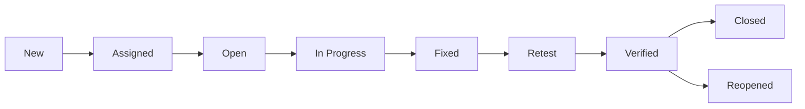

## 1. What is Manual Testing?
> Testing the software or application repetatly  or again and again manually in order to find the defect in to software according to the customer requirement is called as manual testing. 

# Content of Manual testing

1. SDLC (software development life cycle)
2. Software Testing
3. Test cases
4. STLC (software testing life cycle)
5. Test Plan
6. Defect life cycle
7. ISTQB Question

---
## 1. SDLC (software development life cycle)
Defination : SDLC is a step by step procedure or standard procedure to develop a new software. 

## Types of SDLC Model
1. Waterfall model
2. Spiral Model
3. V & V Model
4. Prototype Model
5. Dirived Model
6. Hybride Model
7. Agile Model

### Waterfall model
Waterfall model is a step by step procedure or standard procedure to develop a new software.

#### Stage
- Requirement Collection
    - feasibilty Study
        - Design
            - Coading
                - Testing
                    - Installation
                        - Mainataince

#### Spiral model

Note: Add stage or diagram

#### V and V Mdodel

Note: Add stage or diagram

#### Agile Model
- Agile is an itaration and incrimental approch where customer keeps on chnaging the requirement as company we will flexible enough to take up all the requiremnt chnages. develop the chnages, test the chnages and give quality software to customer within short span of time "This is called as Agile"

#### Principles of Agile / Advantages
- Customer can chnage the requiremnet at any stage of development
- There will good communication between customer, BA, Developer and test engineer.
- Release should be very short
- Our highest prioroty is customer satisfication by quick delivery.
- Software is very simple model to follow
- Teams will be self organized
- Dev's, TE's , and BA will be having meeting very regulary, It will be helpfull to imporve the preocss. 

#### Scrum model
- Scrum model is standard procedure which helps team to work together and develop a new software. 

#### Agile terminologies
1. **Release** : Combination of sprints is called as Release.
2. **Epic** : complite set of requiremnt is called as Epic.
3. **User Story** : Stories are nothing but feature or functionality or module.
4. **Story point** : Story point is a rough estimation given by developers and test engineers to develop & test every indivisual stories.
5. **Swag** : Swag is rough estimation given by decelopers and test engineer to develop and test every individual stories in the from of hours.
6. **Sprint** : It is the actual time spen by the developer and test engineers to develop and test one or more stories.

#### Scrum meetings / scrum ceremonies
1. **print Planning**: Sprint Planning is a Scrum event where the Scrum Team collaboratively decides what work will be completed during the upcoming Sprint and creates a plan for delivering it.

    - Reviews and discusses Product Backlog Items/User Stories.
    - Clarifies requirements and acceptance criteria.
    - Selects the work that can realistically be completed in the Sprint.
    - Breaks stories into tasks where appropriate.
    - Estimates the work and identifies dependencies or risks.
    - Defines the Sprint Goal.

2. **Scrum Meeting / Daily Scrum / DSM** : Daily Scrum is a short, daily Scrum event where Developers inspect progress toward the Sprint Goal and identify any impediments or adjustments needed to achieve the Sprint Goal.  Typical discussion:
    - What did I complete yesterday?
    - What am I planning to work on today?
    - Do I have any blockers or impediments?

3. **Sprint Retrospective Meeting** : Sprint Retrospective is a Scrum event held at the end of a Sprint where the Scrum Team reflects on how the Sprint went and identifies improvements to make in the next Sprint.  The team typically discusses:
    - What went well?
    - What did not go well?
    - What can we improve?
    - What action items should we take?

4. **Release Retrospective Meeting** : A Release Retrospective is a meeting held after a major release to review the overall release process, identify what went well and what could be improved, and define actions for future releases. The team might identify: 
    - Regression took too long.
    - Some requirements changed late.
    - Automation reduced manual testing effort.
    - Production defects occurred because of missing test coverage.

5. **Bug Triage / Defect Triage Meeting** : Bug or Defect Triage is a meeting where reported defects are reviewed, analyzed, prioritized, assigned, and tracked based on their severity, impact, and business priority.

6. **Backlog Grooming / Backlog Refinement** : Backlog Refinement is an ongoing activity where the Scrum Team reviews and prepares upcoming Product Backlog Items so they are sufficiently understood, appropriately sized, and ready for future Sprints. During refinement:

    - Requirements are discussed.
    - User stories are clarified.
    - Acceptance criteria are reviewed.
    - Dependencies are identified.
    - Stories may be split into smaller stories.
    - Estimates are discussed.
    - Questions and ambiguities are resolved.
    - Items may be reordered based on product needs. 

---

## 2. Software Testing
- The process of identyfying or catching defect in the software is called as software testing.

## Type of Software Testing
   1. White Box Testing
        1. Path Testing
        2. Conditional tetsing
        3. Loop Tetsing
        4. Unit Testing
        5. Testing the code from memory point of view
        6. Testing the code from performnace point of view

    2. Black Box Testing
        1. Function Testing
        2. Integration Testing
        3. System testing
        4. Acceptance Testing
        5. Smock TEsting
        6. Adhoc tesing
        7. Globalization tetsing
        8. compatibility testing
        9. Exploratory testing
        10. USability testing
        11. Regression testing

### White box testing.
- Testing rhe each and every line of the code is called WBT.

#### 1. Path Testing
- Here developer will write the flow chart and test the each and every indivisual path.

#### 2. Conditional tetsing
- Here developer will test the code from logical conditional that is for both "true" and "false" condition.  

#### 3. Loop Tetsing
- Here develpoer will test the loop and ensure that loop is repeating for all the defined numer of cycle.

#### 4. Unit Testing
- Customer will the requiremnet, developer will write main program for the requirement  and write the correspoing test program in the same language  and run  the test program against main program, where in test program will automatically test the main program and give the result in 'pass' and 'fail'. 

### Block Box Testing
- Testing or verifying the functionality or behaviour oa an application or software against customer requirement specification is called block box testing. 

#### 1. Functionl Testing
- Testing the each and every component of application regorously / throughtly against customer requiremnt  specification is called as functional testing
    1. Over testing / Exhastive testing
    - Testing  the each and every componet of an application by entering data is does not make any sence 

    2. Under testing
    - Testing each and every component of an application by entering insufficient set of data is called under testing. 

    3. Optimized testing
    - Testing each and every component by entering the data which make sense is called optimised testing. 

#### 2. Integration testing
- Testing the data flow or interface between two or more module/feature is called inegration testing.
    1. Incremental integration testing
    - Incrementally adding the modules and testing rhe data flow between the modules is called as incremental integration testing. 

    2. Non-Incremental testing
    - Here we combine all the module is one shot and shot and test the data flow between module is called as non-incremental integartion testing. 

#### 3. System testing. 
- It is an end end to end testing dobe by the test engineer in testing server/env whcih is similar to the production server/env. 

#### 4. Acceptance testing
- It is end to end testing done by endusers / customers where in they use software for real time bisiness for some particular period of time and check whether software can hanlde all the business scenarions and situations. 
    1. User Acceptance testing.
    2. Operational Acceptance testing
    3. Contact Acceptance testing
    4. Compliance appecptance tetsing
    5. Beta Acceptance testing.

#### 5. Smock testing
- Testing the basic and ctitical feature of an application before doing throght/regorously testing is called as smoke testing 

    1. Formal smoke testing
    - Development lead will send a build to testing and TL will assign feature to TE and ask to do smoke testing and they will preapre report. 

    2. Informal smoke testing
    - TL will assign feature to TE and TL will not ask test engineers to do testing and TE even to do smoke testing they will not prepare any skome test reports.

#### 6. Adhoc testing
- Testing the software randomly without looking in to the requiremnets is called Adhoc testing.
    1. Buddy testing - [dev and TE]
    2. Pair testing - [tester and TE] 
    3. Monkey testing - [TE]

#### 7. Globalization testing
    1. I18N Testing
    - Testing the software which is developed for different lauguage is I18N testing.

    2. L10N Testing
    - Testing the software and check wheather application is develeoped as per the country standards /country culture is called L10N testing. 

#### 8. Compatibility testing
- Testing the functionality of an application or software for different hardware and software configuration is called as compatilibity testing.
    1. Hardware compatibility testing
    2. Software compatibility testing

#### 9. Exploratory testing
- Understand the application indentify ll possible scenarios, document the scenarios and test the application by refering the document is called exporatory testing.  

#### 10. USability testing
- Testing the user frindlyness of application is called usability testing. 
    1. Yellow Box testing
    2. GUI testing
    3. Accessibility testing.

#### 11. Regression testing
- Testing the unchanged / load feature to make sure that chnaged like adding a feature, removing, modifying a feature and fixing defect is not introducing modifying any defects in the unchnaged / old feature is called a regression. 

    1. Unit regression testing
    - Testing only changes or modification done by the developers is called unit regression testing.

    2. Regional regression testing
    - Testing the changes and impacted /affected area is called as regionl regression testing.

    3. full regression testing. 
    ---

## 4. STLC (Software Test Life Cycle)
- STLC is a step by step or standard procedure to test a new software

    - System study (here we understand the requirement)
    - Write test plan
    - write test case
    - Prepare Tracebility Matrix
    - Test case execution
    - Defect Tracking
    - Prepare test case execution report
    - Postmortom / Project Closer / Restrospective meeting.  
---

## 5. Test Plan
    - Test plan is a document which drives all future testing activities.

    #### Test plan consists of 15 stages 
    - Objective
    - Scope
    - Test menthodlogy
    - Test approchs
    - Assumptions 
    - Risk
    - Backup plan
    - Roles and Responsibilities
    - Scheduling
    - Defect tracting
    - Test Env
    - Entry and Exit criteria
    - Test Automation
    - Deliverables
    - Templates.

## Test cases
1. **Test Scenario** : A test scenario is a high-level description of a real business flow or user action that needs to be tested.

### Example

- User logs in and places an order
- User searches for a product and filters results
- User updates profile details

2. **Test Case** :  A test case is a complete set of steps, input values, preconditions, expected results, and postconditions used to validate a specific behavior.

### Standard test case fields

- Test case ID
- Test case name
- Objective
- Preconditions
- Test data
- Steps
- Expected result
- Actual result
- Status
- Test case type
- Post condtions
- Severity

### Example test case

**Title:** Verify login with valid credentials

- Precondition: User is on login page
- Steps:
  1. Enter valid username
  2. Enter valid password
  3. Click Login
- Expected result: User is redirected to homepage and login succeeds

---

## 3. Difference Between Test Scenario and Test Case

| Test Scenario | Test Case |
| -- | -- |
| High-level business flow | Detailed execution steps |
| Example: login process | Example: enter valid username and click login |
| Broad coverage | Specific validation |

> A test scenario may generate multiple test cases.

---

## 4. Positive Testing

Positive testing verifies that the system behaves correctly for valid inputs and expected actions.

### Example

- login with valid username/password
- submit valid form data
- apply valid search filter

### Goal

Ensure that the product works as intended for valid use.

---

## 5. Negative Testing

Negative testing checks whether the system handles invalid, wrong, or unexpected input correctly.

### Example

- login with wrong password
- enter special characters in name field
- invalid email format
- empty mandatory field

### Goal

Ensure the system rejects invalid input gracefully and shows appropriate messages.

---

### Test case design Technique 
1. Error Gussing
2. Equivalence Partition 
3. Boundary Value Analysis (BVA)
4. Decission Table Technique
5. State Transistion Diagram

1. **Error Gussing** : Error guessing is based on tester experience and intuition. The tester tries scenarios likely to fail.
    
    - blank fields
    - duplicate entries
    - unsupported special characters
    - wrong sequence of steps

2. **Equivalence Partition** : Equivalence partitioning divides input data into groups that are expected to behave similarly
    1. Pressmen rule
    2. Pracice method. 

    ### Pressmen rule: 
        1. <Rule 1>: If the input `range of values` then design the test cases for one valid and two invalid values. 

        2. <Rule 2> : If the input is `set of values` then design the test cases for one valid and two invalid values. 

        3. <Rule 3> : If the input is `boolean` then design the test cases for both "true / false" values

    ### Practice method 
        - If the input is range of values then divide the range into equal parts and test for all those values and atleast test for two invalid values this is called practice method

3. Boundary Value Analysis (BVA): Boundary value analysis checks values at the edge of valid and invalid ranges.

### Example

If age must be 18 to 60:

- valid boundary values: 18, 60
- just below boundary: 17
- just above boundary: 61

> Boundary values often reveal defects that normal average values miss.

## 8. Decision Table Testing

Decision table testing is used when multiple conditions lead to multiple outcomes.

### Example

For login:

- if username valid and password valid → allow login
- if username valid and password invalid → show error
- if username invalid and password valid → show error
- if both invalid → show error

This method is useful for rules-based logic.

---

## 9. State Transition Testing

State transition testing validates behavior when an application moves from one state to another.

### Example

- user logged out → login → logged in → logout → logged out

This is useful in workflows like login, shopping cart, or approval systems.
---

## 6. Defect life cycle
- **Defect** : If a feature / functionality is not working according to the customer requirment is called as defect.

    1. Defect 
        1. Severity
            - Blocker
            - Critical
            - Major
            - Minor

        2. Priority
            - High
            - Medium
            - Low

### Severity

Severity describes the impact of the defect on the system.

Examples:

- Critical: application crashes, data loss, security issue
- Major: important feature is broken
- Moderate: feature works but in a limited way
- Minor: cosmetic or minor usability issue

### Priority

Priority defines how quickly the defect needs to be fixed.

Examples:

- P1: fix immediately
- P2: fix in next release
- P3: fix when time allows

> Severity is about business/system impact; priority is about urgency.

### A defect goes through several stages:

1. New
2. Assigned
3. Open
4. In Progress
5. Fixed
6. Retest
7. Verified
8. Closed
9. Reopened (if required)

### Diagram

---

### Bug Report Template

A proper defect report usually includes:

- Defect ID
- Title
- Severity
- Priority
- Module/Feature
- Environment
- Steps to reproduce
- Expected result
- Actual result
- Screenshots/video
- Assignee
- Status

### Duplicate Defects

When the same defect is reported multiple times, it is considered a duplicate. The tester should avoid duplicate entries and use the existing defect ID.

---

### Defect Rejection

A defect can be rejected if it is not reproducible, not valid, or outside the product requirements.

### Common rejection reasons

- not reproducible
- duplicate
- not a valid defect
- requirement mismatch due to misunderstanding

---

### Defect Closure

A defect is closed when:

- fix is implemented
- retest is passed
- the developer and tester agree the issue is resolved

---

## 7. ISTQB Question

### 1. What is Defect?

If a feature/functionality is not working according to the customer requirement, it is called a **defect**.

**OR**

Deviation from the customer requirement specification is called a **defect**.

### 2. Because of What Defect/Mistake Done by Developer Will There Be a Defect in Software?

- Wrong implementation
- Extra implementation
- Missing implementation

### 3. What Is the Difference Between Error, Bug, Failure, and Defect?

- **Error:** Mistake done in the code because of which we will not be able to compile the code or run the code is called an **error**.
  - It is mainly used by **developers**.
- **Defect:** An error found in the software is called a **defect**.
- **Bug:** Bug is an informal name given to a defect and is also a defect accepted by developers.
- **Failure:** Many defects present in the software can lead to **failure**.
  - It is mainly used by **end users/customers**.

### 4. Why Do We Do Testing?

- To ensure the quality.
- To ensure whether all the requirements are implemented correctly.

### 5. What Are the Types of Defects?

- Wrong implementation
- Functionality defect
- GUI (Graphical User Interface / information) defect
- Missing implementation
- Performance defect
- Database defect
- Blocker defect
- Web security defect
- Critical defect
- Major defect
- Minor defect

### 6. Yellow Box Testing

Testing the **warning messages** of an application is called **Yellow Box Testing**.

It is a subset of **Usability Testing**.

**Examples:**

- Battery full
- Battery about to die
- Storage full

### 7. Formal Testing

Testing the software by following the procedure, guidelines, or documents is called **Formal Testing**.

Here, we document all:

- Test plans
- Test cases
- Test scenarios

We also review all documents.

### 8. Informal Testing

Testing the software without following procedures, guidelines, or documents is called **Informal Testing**.

Here, we will not have documented:

- Test plans
- Test cases
- Test scenarios

### 9. Accessibility Testing / ADA Testing

**ADA = American Disability Act**

Testing the application/software from the point of view of physically challenged people is called **Accessibility Testing**.

**Example:** ATM testing for deaf and dumb people.

### 10. Fatal Defect / Blocker / Show Stopper

It is another name given to a **Blocker Defect**.

Because of this defect, the test engineer will be completely blocked from testing the assigned module.

It is called:

- Blocker defect
- Show stopper
- Fatal defect

**Example:**

`YouTube [Home] → [404 Error / Blank Page] → Blocker Defect`

### 11. Deferred Defect / Minor Defect / Trivial Defect

It is another name given to a **minor defect** which will not affect the customer's business workflow.

This type of defect is called:

- Minor defect
- Deferred defect
- Trivial defect

### 12. Defect Release / Bug Release

Releasing the software with a known set of defects is called **Bug Release** or **Defect Release**.

Here, the known defects are generally minor and within an acceptable limit.

### 13. Defect Leakage / Bug Leakage

A defect missed by a test engineer but caught by the customer is called **Defect Leakage** or **Bug Leakage**.

### 14. Defect Seeding

The process of intentionally inserting defects into software by the developer is called **Defect Seeding**.

### 15. What Are the Types of Software Testing?

There are multiple ways to classify software testing.

**1st Answer:**

- WBT (White Box Testing)
- BBT (Black Box Testing)
- Grey Box Testing

**2nd Answer:**

- Functional Testing
- Non-Functional Testing

**3rd Answer:**

- Static Testing
- Dynamic Testing

**4th Answer:**

- QA (Quality Assurance)
- QC (Quality Control)

### 16. Functional Testing vs Non-Functional Testing

| Functional Testing | Non-Functional Testing |
|---|---|
| Functional Testing | Usability Testing |
| Integration Testing | Performance Testing |
| System Testing | Recovery Testing |
| Smoke Testing | Reliability Testing |
| Regression Testing | GUI Testing |
| Adhoc Testing | Yellow Box Testing |
| Exploratory Testing | Globalization Testing |
| Alpha & Beta Testing | Comparison Testing |
| Acceptance Testing | Compatibility Testing |
|  | Migration Testing |
|  | Web Security Testing |

### 17. Static Testing vs Dynamic Testing

| Static Testing | Dynamic Testing |
|---|---|
| Static testing involves all the verification activities. | Dynamic testing involves all the validation activities. |
| Verification activities involve reviews, walkthroughs, inspection, and auditing. | Validation includes actual testing such as FT, IT, ST, Smoke, Adhoc Testing, etc. |
| Here we try to prevent defects. | Here we try to find defects. |
| Static testing is done before the software is developed. | Dynamic testing is done after the software is developed. |
| In static testing we ensure that we are building the product right. | In dynamic testing we ensure that we are building the right product. |
| It is less costly. | It is more costly. |
| Here we don't execute the code. | Here we execute the code. |

### 18. QA (Quality Assurance) vs QC (Quality Control)

| QA (Process) | QC (Product) |
|---|---|
| 1. QA is the set of activities which ensures quality in the process. | 1. QC is the set of activities which ensures quality in the product. |
| 2. This is a proactive process. | 2. This is reactive. |
| 3. Aims to prevent defects. | 3. Aims to find defects. |
| 4. Verification is the best example for QA. | 4. Validation is the best example for QC. |
| 5. QA is process-oriented. | 5. QC is product-oriented. |
| 6. Goal of QA is to improve development and testing processes so that defects do not arise in the future. | 6. Goal of QC is to find defects in the software while testing. |
| 7. QA is planning. | 7. QC is executing the plan. |
| 8. Here we identify weaknesses in the process and try to improve them. | 8. We try to identify defects in the software and improve product quality. |

### 19. Performance Testing / Baseline Testing / Breakpoint Testing / Benchmark Testing / Spike Testing / Bottleneck Testing / Threshold Testing

Testing the **stability and response time** of an application by applying load is called **Performance Testing**.

The requirement which specifies performance testing is called the **Baseline Document**.

Performance testing is also referred to as **Baseline Testing, Breakpoint Testing, Benchmark Testing, Spike Testing, Bottleneck Testing,** or **Threshold Testing** in different contexts.

- **Load:** Load is nothing but the designed number of users.
  - Load can be specified by the customer, BA, Senior Developer, Senior Test Engineer, or Manager.

**Example: Facebook**

`Login → Load ← 10,000 users try to login at the same time → Home`

### 20. Stability and Response Time

**Stability:** An ability of an application to withstand the designed load (number of users) is called the **stability** of an application.

**Response Time:** Response time is the total time taken to:

- Send the request from the browser to the server (`T1`)
- Run the program on the server (`T2`)
- Get the response from the server back to the browser (`T3`)

**Example:**

If the home page is displayed successfully for all 10,000 users, it is called **stability of the application**.

If the customer requirement says that the home page should be displayed for all 10,000 users within 10 seconds, then **10 seconds is the response time**.

### 21. Types of Performance Testing

There are five types:

- Load Testing
- Stress Testing
- Volume Testing
- Scalability Testing
- Soak / Endurance Testing

**Example Performance Requirement:**

- Load: 10,000 users
- Response Time: 10 seconds

`Amazon.com Login → Home`

#### 1. Load Testing (`<=`)

Testing the stability/response time of an application by applying a load that is **less than or equal to the designed number of users** is called **Load Testing**.

| Load | Response Time | Result |
|---:|---:|---|
| 6,000 | 6 sec | Displayed |
| 10,000 | 10 sec | Displayed |
| 1,000 | 11 sec | Displayed, but load testing fails because response time exceeds the requirement |

#### 2. Stress Testing

Testing the stability/response time of an application by applying a load that is **greater than the designed number of users** is called **Stress Testing**.

| Load (>) | Response Time | Result |
|---:|---:|---|
| 11,000 | 7 sec | Displayed |
| 12,000 | 7 sec | Displayed |
| 15,000 | 8 sec | Displayed |
| 20,000 | 9 sec | Not displayed |

#### 3. Volume Testing

Testing the stability/response time of an application by transferring a **huge amount/volume of data** is called **Volume Testing**.

It is mainly done to check the **capacity of the database server**.

**Example:**

`System → Server → Database → Huge amount / volume of data in the database`

#### 4. Scalability Testing

Testing the stability and response time of an application by applying a load that is greater than the designed number of users and checking the **break point** of the application (the point where the application/software gets crashed) is called **Scalability Testing**.

| Load | Response Time | Result |
|---:|---:|---|
| 25,000 | 7 sec | Displayed |
| 35,000 | 8 sec | Displayed |
| 40,000 | 8 sec | Displayed |
| 45,000 | 12 sec | Not displayed |

#### 5. Soak Testing / Endurance Testing

Testing the stability and response time of an application by applying load **continuously for a particular period of time** is called **Soak Testing / Endurance Testing**.

**Example:**

Suppose you logged in to a Yahoo application and used the application without logging out for two days. When you try to use/launch the application again, the application should still be working properly.

### 22. How to Do Performance Testing Manually

**Customer Requirement:**

- Load: 10 users
- Response Time: 10 seconds

`10 users → Test Engineer → Server → Performance Testing Manually`

- Start Time = `--:--`
- Stop Time = `--:--`

If the customer gives a very high load, such as **1 crore users**, we cannot do it manually because the number of users is too high. This is one reason we use **automation tools**.

**Performance Testing Tools Available in the Market:**

- LoadRunner — Licensed version
- JMeter
- NeoLoad
- QA Load
- Silk Performance Tool
- Rational Performance Tool

### 23. How Does the Performance Testing Tool Look / Work?

#### LoadRunner

**Buttons:**

- Start Recording
- Stop Recording
- Play (`>`)
- Pause (`||`)
- Stop

**Inputs:**

- Enter the URL
- Number of users
- Start time
- Stop time
- Date & Time

**Steps:**

1. Click the **Start Recording** button.
2. Perform the action, such as opening the browser and entering the URL.
3. Click the **Stop Recording** button.
4. The performance testing tool converts the performed actions into an automation script.

### Continuation of LoadRunner Process

- Enter the URL and number of users into the tool.
- Click the **Play / Run** button.
- VUGen generates the required number of dummy users.
- Click the **Stop** button when the test is completed.
- Record the start time and end time in the tool.
- All users from their respective browsers send requests to the server (`T1`).
- The program runs on the server (`T2`).
- The server sends the response back to all users (`T3`).

**Note:** In some performance tools, system time is taken by default.

### 24. Thick Client / Standalone Application / Client-Server Application

A software application that is installed on the **client machine** is called a **Thick Client**.

**Examples:**

- Microsoft Word
- Notepad
- WhatsApp
- Chrome Browser
- Facebook APK

### 25. Thin Client / Web Application

A software application where the software is installed on the **server** and users access it to perform work is called a **Thin Client**.

**Examples:**

- Gmail — [www.gmail.com](https://www.gmail.com)
- Facebook — [www.facebook.com](https://www.facebook.com)

### 26. Testware

**Testware** is a terminology used to describe the documents/artifacts used while testing software.

**Examples:**

- Test Scenarios
- Test Cases
- Defect Reports
- Traceability Matrix
- Test Scripts
- Test Plan

### 27. Interrupt Testing

It is the process of replicating an **interrupt** or an **abrupt interruption** in an application/software to verify how the application behaves.

### 28. Types of Requirement

- Functional Requirement
- Non-Functional Requirement

**Functional Requirements are tested using:**

- Functional Testing
- Integration Testing
- System Testing
- Smoke Testing
- Acceptance Testing
- Adhoc Testing
- Regression Testing

**Non-Functional Requirements are tested using:**

- Performance Testing
- Usability Testing
- Globalization Testing
- Compatibility Testing
- Migration Testing
- Comparison Testing

### 29. Migration Testing

Whenever the technology is outdated or the database is outdated, we migrate from the old technology/database to a new/latest technology/database.

Testing during this migration is called **Migration Testing**.

**Example:**

`Old Technology (1997: Mainframe, SQL) → New Technology (2022: Java, Oracle)`

### 30. Comparison Testing / Parallel Testing

Here we compare a newly built application with a similar application released in the market.

We check:

- Strengths and weaknesses
- Advantages and disadvantages
- Whether all required features are present in our newly built application

This is called **Comparison Testing**.

**Examples:**

- Flipkart → Amazon
- Telegram → WhatsApp
- Zomato → Swiggy
- UpGrad → Unacademy
- Ola → Uber

### 31. Failure

Deviation from the requirement specification that is **visible to the end user** is called **Failure**.

### 32. How to Calculate Defect Density?

**Defect Density** is generally calculated as:

`Defect Density = Number of Defects / Size of the Software`

**Example:**

If a module has 20 defects and the module size is 10 KLOC:

`Defect Density = 20 / 10 = 2 defects per KLOC`

### 33. When to Do Testing?

Testing can be performed based on the project situation, for example:

- When the product is functionally stable (good quality).
- When the basic functionality itself is not working (blocker).
- When the time span is less, test all basic and important features and then stop testing.
- When there is no budget.

### 34. Defect Masking / Fault Masking / Bug Masking / Defect Hiding

One defect hiding another defect is called **Defect Masking**.

**Example: Instagram**

- **Build B1:** `Home → [Blank Page] → Defect`
- **Build B2:** `Login → [Blank Page]`

The defect in one area may hide another defect.

### 35. Defect Cascading / Bug Cascading

One defect triggering another defect is called **Defect Cascading**.

**OR**

Defect cascading means one defect causing another defect is called **Defect Cascading**.

**Example: Citibank Application**

`Customer Requirement → Developer writes code + WBT → Home`

Features:

- Amount Transfer
- Amount Balance
- Loan
- Insurance

**Defect:** Amount 500 is debited.

**Amount Transfer:**

`From [ ] → To [ ] → Amount [-100] → [Transfer] [Cancel]`

**Requirement:** It should accept only positive (`+`) integers.

A confirmation message is displayed.

### 36. Defect Clustering

Some modules consist of most of the defects, and defects are not equally distributed among all modules.

These defects may lead to operational failure, and this concept is called **Defect Clustering**.

**Example:**

- Module A, B → 7 defects
- Module C, D → 6 defects
- 48 defects → Operational failure

> As soon as the Test Engineer gets a build, they should perform smoke testing properly, identify the impacted areas, and perform proper regression testing.

### 37. Principles of Software Testing / Manual Testing

- We should not do exhaustive testing.
- We should do early testing.
- Testing should be done to show the presence of defects in the software.
- We should focus on the **Pesticide Paradox**.
- We should focus on **Defect Clustering**.
- Testing is context-dependent. Depending on the type of application and how the customer will use the software, testing should be planned accordingly.
- Absence of errors in the application does not mean that the application is free from defects.

### 38. Pesticide Paradox

If you run the same test cases for many executions, those test cases may lose their capability to catch new and creative defects. This concept is called the **Pesticide Paradox**.

To overcome this, we should keep updating and improving the test cases from time to time.

**Example:**

`Release 1 → Module A → 100 Test Cases → Update for every release`

### 39. What Is a Latent Defect?

A defect that is present in the software but is not identified for a particular period of time is called a **Latent Defect**.

### 40. What Is a Use Case?

A **Use Case** is a pictorial representation of a requirement that explains how the end user interacts with the application and describes the possible ways the end user can use the application.

**Example: QSpiders**

**Features:**

- Attendance
- Mock Rating
- Fees Details
- Date of Joining
- Masterly
- Education

**Roles:**

- HR
- Counselor
- Trainer
- Students
- Attendance Team
- Admin

### 41. What Are the Levels of Testing?

- Unit Testing
- Integration Testing
- System Testing
- Acceptance Testing

### 42. Test Basis

**Test Basis** is a document/source that is used to write test cases.

**Examples:**

- CRS
- BRS
- Use Case
- FS

### 43. Test Artifacts

These are the set of documents used by the Test Engineer during the **STLC process**:

- Test Strategy
- Test Plan
- Test Scenarios
- Test Cases
- Traceability Matrix
- Test Execution Reports
- Defect Report Template

### 44. Compliance Testing

It is a type of **non-functional testing** performed to check whether the software developed meets the company's standards or the respective organizational standards.

### 45. Pilot Testing

Pilot Testing is done by a selected set of people who perform a trial run on the project and provide feedback to the company before releasing the software to customers.

### 46. Risk-Based Testing

Risk-Based Testing is testing performed by the Test Engineer based on **risk**.

Here, the Test Engineer prioritizes and tests the features/functionality of the application that have a **high risk of failure**.

### 47. Reliability Testing

Testing the functionality of an application continuously for a particular period of time is called **Reliability Testing**.

- It is mainly done for **Standalone** and **Client-Server applications**.
- Doing Reliability Testing manually is a very tough job, so we can use automation tools to perform it.

### 48. Difference Between Reliability Testing and Soak Testing

| Reliability Testing | Soak / Endurance Testing |
|---|---|
| Testing the functionality of an application continuously for a particular period of time is called Reliability Testing. | Testing the stability and response time of an application by applying load continuously for a particular period of time is called Soak / Endurance Testing. |
| It is mainly done for Standalone and Client-Server applications. | It is mainly done for Web Applications and Client-Server applications. |
| Here we don't apply load. | Here we apply load. |

### 49. Recovery Testing

Testing the functionality of the application to check how well the application recovers from **crashes or disasters** is called **Recovery Testing**.

- Recovery Testing is mainly done for **Standalone** and **Client-Server applications**.

**Example:**

`WhatsApp → [Chats | Status | Call] → "WhatsApp isn't responding"`

### 50. Difference Between Prototype and Use Case

| Prototype | Use Case |
|---|---|
| Prototype module is a dummy module created by developers where text is converted into image format. | Use Case is a pictorial representation of a requirement and explains how the end user interacts with the application. |

### 51. Smoke Testing vs Sanity Testing

| Smoke Testing | Sanity Testing |
|---|---|
| Smoke testing is shallow and wide testing. | Sanity testing is narrow and deep testing. |
| Shallow = high level; Wide = covers all basic and critical features. | Here, one component is selected and tested deeply. |
| **Example:** `[Compose: To, CC, Subject]` → Test only the basic and critical areas of all features, mainly positive scenarios. | **Example:** `[Compose: To, CC, Subject]` → Select one component and test all positive and negative scenarios. |
| Smoke testing is generally positive testing. | Sanity testing includes both positive and negative testing. |
| Smoke test cases and scenarios are documented. | Test cases/scenarios are generally not separately documented. |
| Automation can be used for smoke testing. | Sanity testing is generally performed without dedicated automation. |
| It can be performed by both developers and testers. | It is mainly performed by the Test Engineer. |

### 52. SDLC vs STLC

| SDLC | STLC |
|---|---|
| SDLC is a step-by-step or standard procedure to develop new software/application. | STLC is a step-by-step or standard procedure to test a new feature of an application. |
| SDLC stands for **Software Development Life Cycle**. | STLC stands for **Software Testing Life Cycle**. |
| STLC is part of SDLC. | Defect Life Cycle is part of STLC. |

#### SDLC Stages

`Requirement → Feasibility Study (FS) → Design → Coding → Testing → Installation → Maintenance`

#### STLC Stages

`System Study → Write Test Plan → Write Test Case → Traceability Matrix → Execute Test Case → Defect Tracking → Prepare Test Case Execution Report → Postmortem Meeting`

### 53. Difference Between Regression Testing and Re-Testing

| Regression Testing | Re-Testing |
|---|---|
| 1. Testing the unchanged/old feature to make sure that changes such as adding, removing, modifying a feature, or fixing a defect do not introduce defects in the unchanged/old feature is called **Regression Testing**. | 1. Whenever the Test Engineer gets a new build, checking whether the defect is fixed or not is called **Re-Testing**. |
| 2. Regression testing is done for passed test cases. | 2. Re-testing is done for failed test cases. |
| 3. Regression testing is generic testing. | 3. Re-testing is planned testing. |
| 4. We can use automation for regression testing. | 4. We generally don't automate re-testing separately. |
| 5. Regression testing generally takes less priority compared to re-testing. | 5. Re-testing generally takes higher priority compared to regression testing. |

**Question:** Is there any difference between Unit Regression Testing and Re-Testing?

**Answer:** Yes.

**Example:**

`SBI → Amount Transfer → Requirement: It should accept ...`